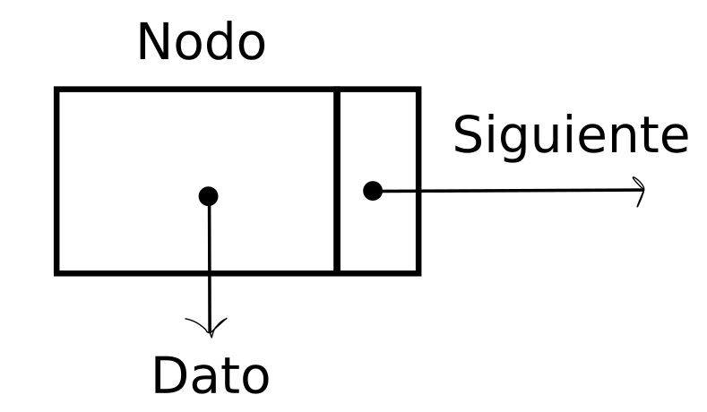
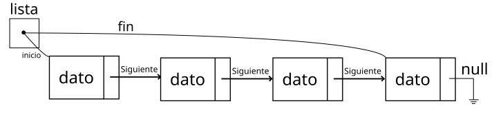
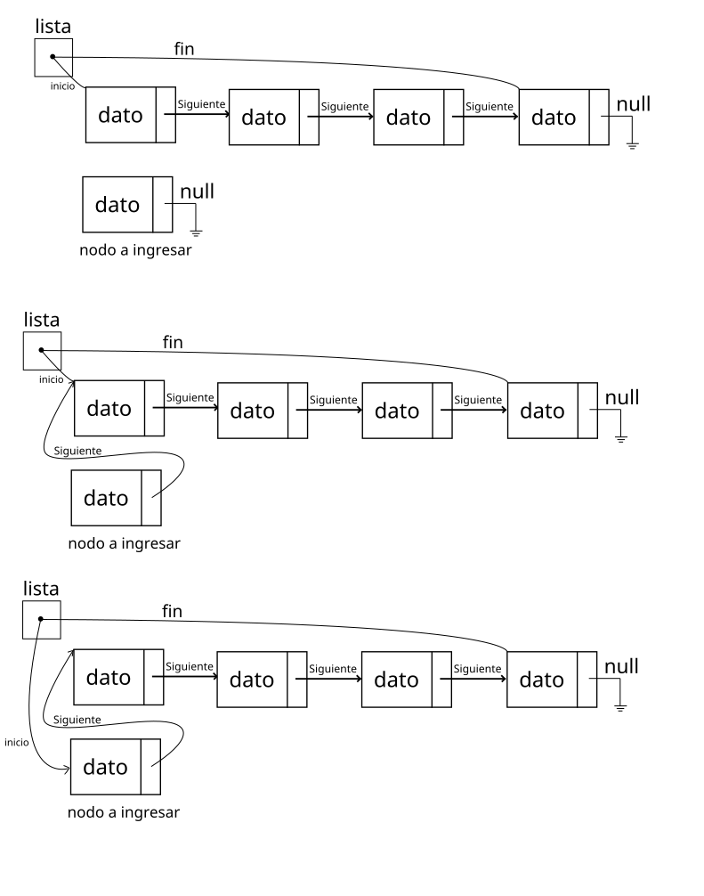
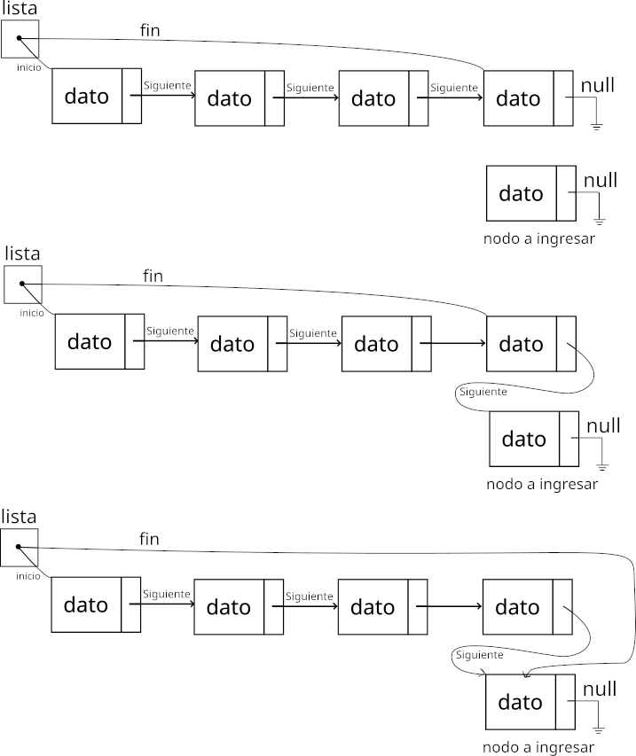
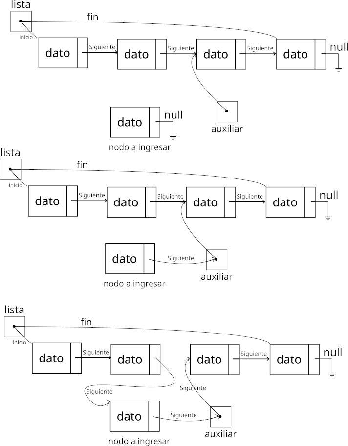
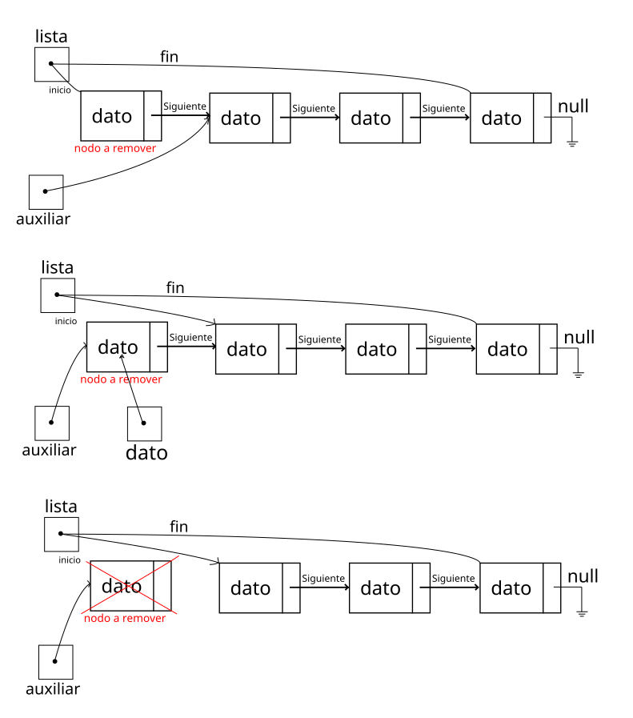
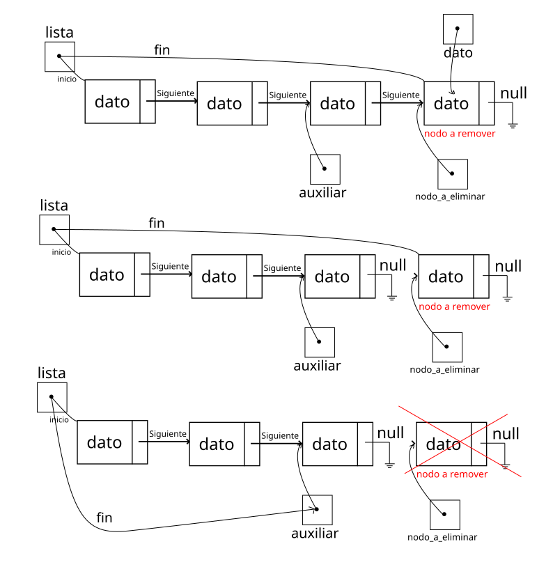
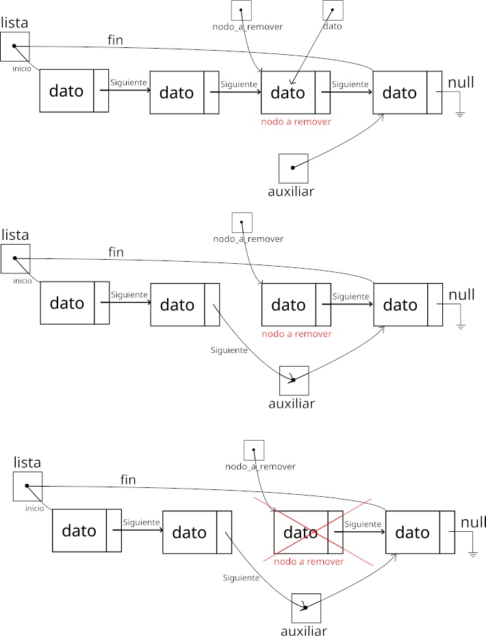
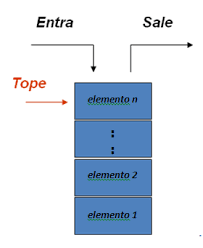
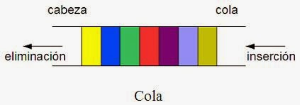

<div align="right">

</div>

# TDA LISTA

## Repositorio de Didier Erik Watson - 96064 - dwatson@fi.uba.ar

- Para compilar:

```bash
make all
```

- Para ejecutar:

```bash
./pruebas_chanutron || ./pruebas_alumno
```

- Para ejecutar con valgrind:
```bash
make valgrind-chanutron || make valgrind-alumno
```
---
# Un poco de teoría 

Un TDA es una abstracción que permite modelar las características de un elemento en particular. Un TDA se puede manipular de forma similar a los tipos de datos que están predefinidos dentro del lenguaje de progamación (nativos), encapsulando más información según se requiera. La idea general del TDA es encapsular el _como_ hacer algo del _que_ se quiere hacer. En el caso de el lenguaje C, el TDA se representa con estructuras.


Una lista es una sucesión finita de cero, uno o más elementos. Desde el punto de vista de las estructuras de datos, una lista es un conjunto finito de
elementos, en el que para acceder a uno de ellos hay que pasar por todos los situados antes que
él. 
Una lista es, por lo tanto, una estructura de datos secuencial.

# Implementación
Este TDA lista se implementará con el concepto de nodos (simplemente) enlazados. Si bien al nodo no se lo considera como un TDA, se lo incluye en la implementación de la lista como algo _opaco_. Como la lista es simplemente enlazada, el nodo tiene solamente un puntero al dato y puntero al siguiente nodo. En caso de que fuera una lista doblemente enlazada, se tendria además un puntero al nodo anterior. Además se tiene un puntero al nodo incial de la lista y otro al último nodo. Esto ayuda a que algunas operaciones de la implementación tengan menor complejidad computacional.

<div align="center">

<br>Representación de un nodo. Para una mejor comprensión lectora, en los futuros graficos el dato se colocará dentro del nodo, pero no deja de ser un puntero al dato.
</div>

<div align="center">

<br>Representación de una lista simplemente enlazada implementada con nodos.
</div>

## Detalles de alguna función y complejidad
Se detallarán en esta sección las funciones `lista_insertar_en_posicion`  y `lista_quitar_de_posicion`.
Estas son las funciones más importantes de la implementación del TDA Lista. Se encargan de enlazar y desenlazar nodos de la lista.


```c 
lista_t * lista_insertar_en_posicion(lista_t *, void *,size_t )
```

Esta función toma un puntero a la lista (previamente creada), un puntero al elemento a almacenar y la posición donde se quiere insertar en la lista. La inserción se separó en tres casos:
* Insertar al principio de la lista 
* Insertar al final de la lista
* Insertar en la n-ésima posición de la lista

Para insertar al final de la lista, directamente se implementó una función para insertar al final de la lista `lista_insertar`.
A continuación se mostrarán figuras de como funciona cada procedimiento.

#### Inserción al principio de la lista
<div align="center">

<br>Representación de una lista simplemente enlazada implementada con nodos.
</div>
<br>
Esta implementación de insertar al principio es O(1), ya que simplemente se reasignan punteros, no importa la ctdad de elementos de la lista.

#### Inserción al final de la lista

<div align="center">

<br> Como funciona insertar al final.
</div>
<br>

Esta implementación de insertar al final también es O(1), ya que al tener un puntero al nodo final, simplemente se tienen que reasignar punteros.

#### Inserción en n-ésima posición

<div align="center">

<br> Como funciona insertar entre principio y final. Se debe guardar en un puntero auxiliar la dirección del nodo anterior a la posición donde se quiere insertar, así no se pierde la referencia luego.
</div>
<br>
Esta implementación de insertar en una posición n es de complejidad O(n), ya que se tiene que recorrer la lista hasta la posición deseada.

```c 
lista_t * lista_quitar_de_posicion(lista_t *,size_t )
```

Esta función recibe un puntero a la lista y la posición del nodo en la lista a remover.
Análogo a insertar, se divieron en tres casos para la remoción del nodo:

* Remover al principio de la lista
* Remover al final de la lista
* Remover la n-ésima posición de la lista

 Para la remoción al final, se implementó se llama a otra función _lista_quitar_, la cual remueve el último nodo de la lista.
 
 
 #### Quitar al principio de la lista

<div align="center">

<br> Como funciona quitar al principio. Se debe guardar en un puntero el nodo a eliminar para no perder la referencia cuando se lo quiera borrar. Además se guarda el dato en otro puntero, para poder ser devuelto luego. Por último se libera la memoria del nodo.
</div>
<br>

La complejidad de esta operación es O(1), ya que simplemente se reasignan punteros sobre nodos

#### Quitar al final de la lista

<div align="center">

<br> Como funciona quitar al principio. Se debe guardar en un puntero el nodo a eliminar para no perder la referencia cuando se lo quiera borrar. Además se guarda el dato en otro puntero, para poder ser devuelto luego.
</div>
<br>

La complejidad de esta implementación es O(1), ya que no se debe recorrer la lista hasta el final, debido que se tiene guardado en un puntero, el último nodo.

#### Quitar en la n-ésima posición de la lista

<div align="center">

<br> Como funciona quitar en una posición n de la lista. Se debe guardar en un puntero el nodo a eliminar para no perder la referencia cuando se lo quiera borrar. Además se guarda el dato en otro puntero, para poder ser devuelto luego. Además, se debe guardar en otro puntero (auxiliar) la direccion donde vive el nodo siguiente al nodo que se quiere eliminar, para no perder la referencia.
</div>
<br>

La complejidad de esta implementación es O(n), ya que se debe recorrer n nodos hasta llegar al que se quiere eliminar.

#### Obtener al inicio

Utilizando la función `lista_primero()` la complejidad es O(1), ya que se tiene un puntero al primer elemento de la lista y es lo que se devuelve.

#### Obtener al final

Utilizando la función `lista_ultimo()`, la complejidad es O(1), ya que se tiene un puntero al último elemento de la lista y es lo que se devuelve.

#### Obtener n-ésima posición
Aquí la complejidad es O(n), ya que se debe recorrer la lista n elementos, hasta la posición deseada.


## Complejidad de insertar/obtener/eliminar con implementación de lista doblemente enlazada.

#### Insertar al inicio
Complejidad O(1), razonamiento idem lista simplemente enlazada.

#### Insertar al final 
Complejidad O(1), razonamiento idem lista simplemente enlazada.

#### Insertar n-ésima posicion
Complejidad O(n), se debe recorrer la lista hasta la n-ésima posición.

#### Obtener al inicio
Complejidad O(1), idem lista simplemente enlazada.

#### Obtener al final
Complejidad O(1), idem lista simplemente enlazada.

#### Obtener n-ésima posición
Complejidad O(n), idem lista simplementa enlazada.

#### Quitar al inicio
Complejidad O(1), idem lista simplemente enlazada.

#### Quitar al final
Complejidad O(1), idem lista simplemente enlazada.

#### Quitar n-ésima posición
Complejidad O(n), idem lista simplemente enlazada.

## Complejidad de insertar/obtener/eliminar con implementación de vector dinámico

#### Insertar al principio
Complejidad O(n), se debe insertar al principio, y en el peor caso que no haya espacio, se redimensiona el vector y se deben reposicionar todos los elementos.

#### Insertar al final 
Complejidad O(n), en el peor caso, se debe redimensionar el vector y copiar todos los elementos previos al nuevo vector.

#### Obtener al inicio/medio/final
En todos los casos la complejidad es O(1), ya que la operación consiste en ir a la posicion (índice) del vector deseada.

## TDA Pila (Implementado con TDA lista)

Un TDA pila es una estructura de datos y que cuenta con la característica principal que el último dato en entrar a la pila es último en salir (LIFO - Last In First out).

<div align="center">

<br> Representación de una pila.
</div>
<br>

La pila se implementó reutilizando el TDA lista. Simplemente se debe castear lo que devuelven las primitivas de TDA Lista, y castear lo que reciben, como se indica a continuación

#### Complejidad de las funciones 
```c
pila_t *pila_crear()
{
 	return (pila_t *)lista_crear();
}
```
Complejidad O(1). Idem a `lista_crear`.

```c
pila_t *pila_apilar(pila_t *pila, void *elemento)
{
	return (pila_t *)lista_insertar_en_posicion((lista_t *)pila, elemento, 0);
}
```
Complejidad O(1). Idem a `lista_insertar_en_posicion(lista,elemento,0)`.

```c
void *pila_desapilar(pila_t *pila)
{
	return (pila_t *)lista_quitar_de_posicion((lista_t *)pila, 0);
}
```
Complejidad O(1). Idem a `lista_quitar_de_posición(lista,elemento,0)`.

```c
void *pila_tope(pila_t *pila)
{
	return (pila_t *)lista_primero((lista_t *)pila);
}
```
Complejidad O(1). Idem a `lista_primero(lista)`.

```c
size_t pila_tamanio(pila_t *pila)
{
	return lista_tamanio((lista_t *)pila);
}
```
Complejidad O(1). Idem a `lista_tamanio(lista)´.

```c
bool pila_vacia(pila_t *pila)
{
	return lista_vacia((lista_t *)pila);
}
```
Complejidad O(1). Idem a `lista_vacía(lista)`.

```c
void pila_destruir(pila_t *pila)
{
	lista_destruir((lista_t *)pila);
}
```
Complejidad O(n). Idem a `lista_destruir(lista)`.


## Cola (implementación con TDA Lista)

Una cola es un grupo ordenado de elementos del mismo tipo, en la cual dichos elementos se añaden por un extremo (Final) y se quitan por el otro extremo (Frente). Esto significa que los elementos se sacan en el mismo orden en el que fueron insertados o introducidos en la cola, siendo por ello considerada como una estructura de datos FIFO (First In First Out), es decir, que el primer elemento en entrar es el primer elemento en salir.

<div align="center">

<br> Representación de una cola.
</div>
<br>

#### Complejidad de las operaciones de la cola

```c
cola_t *cola_crear()
{
	return (cola_t *)lista_crear();
}
```
Complejidad O(1). Idem `lista_crear()`. Se pide memoria para una estructura.

```c
cola_t *cola_encolar(cola_t *cola, void *elemento)
{
	return (cola_t *)lista_insertar((lista_t *)cola, elemento);
}
```
Complejidad O(1). Idem `lista_insertar(lista,elemento)`.

```c
void *cola_desencolar(cola_t *cola)
{
	return (cola_t *)lista_quitar_de_posicion((lista_t *)cola, 0);
}
```
Complejidad O(1). Idem `lista_quitar_de_posicion(lista,0)`.

```c
void *cola_frente(cola_t *cola)
{
	return (cola_t *)lista_primero((lista_t *)cola);
}
```
Complejidad O(1). Idem `lista_primero(lista)`.

```c
size_t cola_tamanio(cola_t *cola)
{
	return lista_tamanio((lista_t *)cola);
}
```
Complejidad O(1). Idem `lista_tamanio(lista)`. Es una operación de devolver el tamanio de la cola (lista).

```c
bool cola_vacia(cola_t *cola)
{
	return lista_vacia((lista_t *)cola);
}
```
Complejidad O(1). Idem `lista_vacia(lista)`.

```c
void cola_destruir(cola_t *cola)
{
	lista_destruir((lista_t *)cola);
}
```
Complejidad O(n). Idem `lista_destruir`. Se deben destruir todos los nodos de la lista. Se realizan n operaciones O(1).


